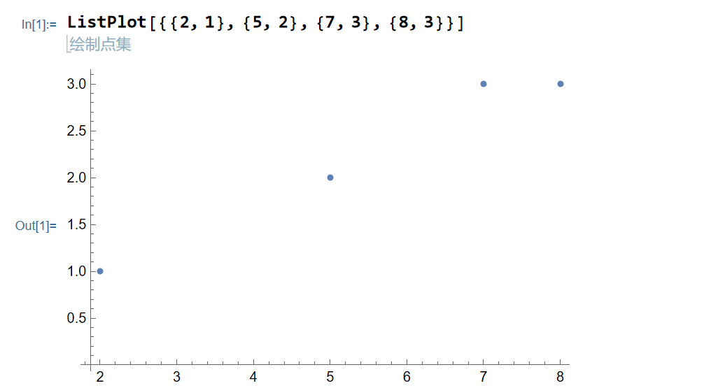
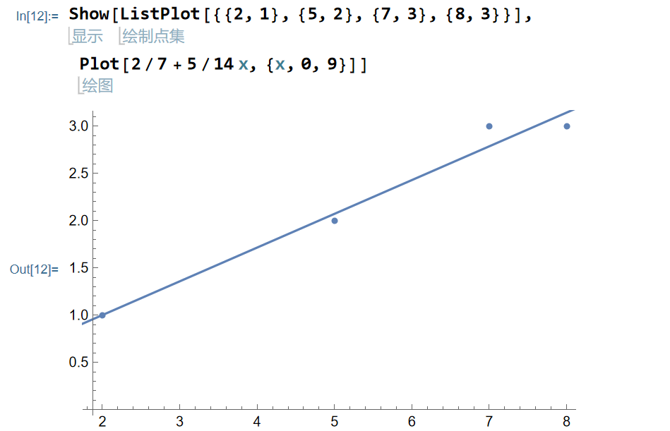

在这章中，我讲主要讲述一下最小二乘法。

我们来看这么几个点(2,1),(5,2),(7,3),(8,3)

我们在图像上画出来

假设你开了一家商铺，横坐标是年，纵坐标是赚的钱，那么请你预测一下第9年你会赚多少钱呢？

看着零散的几个点，我们可以猜测说，年数和纵坐标是成正相关的，或者说，图上的这些点实际上可以被近似的看成一条直线

也就是

或许你也可以这些点近似的看成抛物线，反比例函数。。。

但在本章节中，我们都把点近似的都看成是一种直线，那么现在的问题就来到了，怎样的直线才能最好的“拟合”这些点呢？

在高中阶段或许你们学过一些关于最小二乘法的公式，可以解决二维问题下的问题，但是三维甚至更高纬度情况呢？

就像开店铺的盈利，不止和年限有关，也和用料成本，顾客人数，电费等挂钩，此时我们就要找到最贴切的一个系数
$$
y=a_1x_{年}+a_2x_{成本}+a_3x_{顾客}+a_4x_{电费}+a_5
$$
使得这个y是最贴近给定的事实的

我们已知的情况是
$$
a_{1}x_{年1}+a_{2}x_{成本1}+a_{3}x_{顾客1}+a_{4}x_{电费1}+a_{5} \approx b_1  
\newline
a_{1}x_{年2}+a_{2}x_{成本2}+a_{3}x_{顾客2}+a_{4}x_{电费2}+a_{5} \approx b_2  
\newline
\dots \newline
a_{1}x_{年n}+a_{2}x_{成本n}+a_{3}x_{顾客n}+a_{4}x_{电费n}+a_{5} \approx b_1
$$

写成矩阵的形式也就是
$$
\left[\begin{array}{c}
x_{年1} & x_{成本1} & x_{顾客1} & x_{电费1} &1\\
x_{年2} & x_{成本2} & x_{顾客2} & x_{电费2} &1\\
\dots \\
x_{年n} & x_{成本n} & x_{顾客n} & x_{电费n} &1\\
\end{array}\right]\left[\begin{array}{c}
a_1 \\
a_2 \\
a_3 \\
a_4 \\
a_5
\end{array}\right] \approx
\left[\begin{array}{c}
b_1 \\
b_2 \\
b_3 \\
b_4 \\
b_5
\end{array}\right]
$$
向量化表示相当于我们想要找出合适的x，使得$Ax \approx b$

也就是$Ax -b \approx 0$

$Ax -b \approx 0$是一个新的向量，如果想让他尽可能等于零，如果在二三维空间中，我们喜欢他的长度是尽可能等于0的，更高纬度下，我们定义向量的长度（范数）为

> 在$R^n$中，向量$(x_1,x_2\dots x_n)$的长度（范数）被定义为$||v|\sqrt{x_1^2+x_2^2+\dots x_n^2}$

这个定义实际上也很符合二三维中对于长度的定义

此时相当于我们想找到x，使得$||Ax-b||$最小
