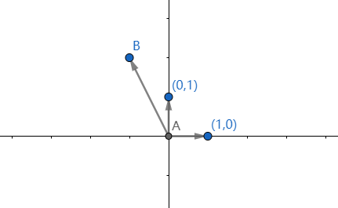
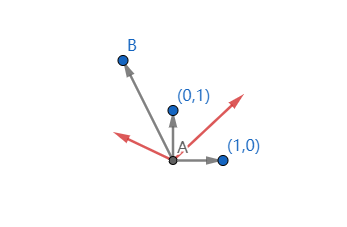
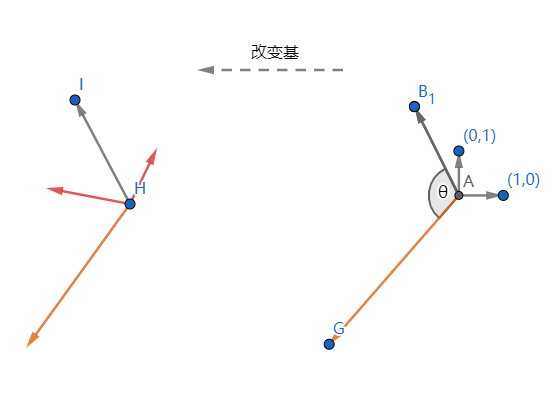
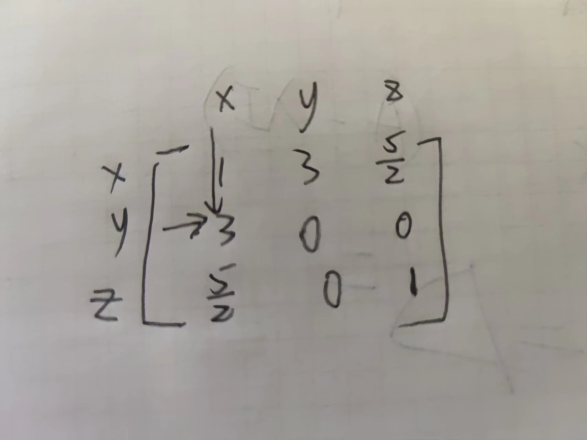

在这里可能一些内容就没有前面几章那么自然地，实际上数学中并没有那么多自然地东西，很多东西都是数学家一步步尝试中猜测并证明出来的，所以说并不存在很多自然地想法。

我们先来看看相似矩阵。

首先我们之前说过，矩阵可以被看成一种函数，一种线性映射。

现在我们有一个向量，被记为(-1,2)

此时我们旋转坐标轴，用心的坐标轴表示这个向量

旋转坐标轴的行为是一个线性映射

我们可以对初始的坐标轴进行两种不同的线性映射A、B，也就是

现在我们考虑矩阵B的特征值w

此时有

另外还有$Bw=\lambda w$

我们说矩阵相似时，那么此时存在一个映射（矩阵）S，使得Su=w（换句话说，对其中一个特征向量进行旋转可以得到另一个）

那么此时就有$BSu=\lambda Su$

这里简单说一下逆的概念，实际上并不复杂，高中我们已经学过逆映射的概念，那么对应的就有逆的线性映射，因为线性映射和矩阵挂钩，因此也有逆矩阵，后面的章节我们会提到

在线性方程组中，如果$Ax=b$那么$x=A^{-1}b$就是逆的一个用处

在这里的话，我们考虑$S^{-1}BSu=\lambda u$

此时如果让A$=S^{-1}BS$就便是相似矩阵，换句话说

> A，B 相似当且仅当存在可逆矩阵S使得$A=S^{-1}BS$

>  特别的，如果矩阵A和对角线矩阵D相似，那么则称A是可对角化的

相似矩阵的意义就是为了说明，这两个矩阵而已通过线性映射互相转化

另外相似的矩阵有一个性质：

> 对于相似的矩阵，他们的特诊值的代数重数是一样的
>
> 证：对于相似的矩阵A,B，A=$S^{-1}BS$
>
> $A-\lambda I=S^{-1}BS-\lambda S^{-1}S=S^{-1}(BS-\lambda S)=S^{-1}(B-\lambda I)S$
>
> 因此$det(A-\lambda I)=det(S^{-1})det (B-\lambda I)det (S)=det (B-\lambda I)det (S)det(S^{-1})$
>
> $=det(B-\lambda I)det(SS^{-1})=det(B-\lambda I)$
>
> 原命题得证

而关于对角线矩阵也有一个性质

> 所有
>
> https://www.zhihu.com/answer/1809589693

# 进入二次型

所谓二次型，就是一个二次的函数，比如$x^2+2xy+y^2,x^2+6xy+z^2+5xz...$这样的函数（注意的是，二次型没有一次项和常数项的）

显然的我们知道$x^2+2xy+y^2=(x+y)^2 \geq 0$那么对于$x^2+6xy+z^2+5xz$他是恒大于0的吗？

我们需要把他化成一堆数的平方和或者差才能知道，也就是我们的标准型

那要怎么弄么，我们不妨把这个复杂的二次型放进矩阵里面（这是很巧的一步）

也就是行列的字母相乘后再乘以矩阵上对应的那个数字，然后全部加起来，就是我们想要的结果，但这样的写法显然不够线代，用矩阵的语言来说，二次型就是形如$x^TAx$的矩阵

可以注意到的是，这个矩阵是对称（沿对角线对称）,更准确的定义是

> 矩阵A如果被称为对称，那么$A^T=A$

而此时我们想要让矩阵称为一堆平方的和或差，此时，就相当于要把矩阵A化成一个对角线矩阵的样子

比如$x^2+2xy+y^2$的矩阵表示为
$$
k^T\left[\begin{array}{rrr}
1 & 1\\
1&1 
\end{array}\right]k
$$
此时我们知道他可以被化成$(x+y)^2$

那么实际上他可以被化成
$$
s^TDs=[x+y,0]\left[\begin{array}{rrr}
1 & 0\\
0&0 
\end{array}\right]
\left[\begin{array}{rrr}
x+y\\
0 
\end{array}\right]
$$
此时中间的这个矩阵就是对角线矩阵

我们可以看到，这里实际上有一个
$$
[x,y]^T=k=Ps=P[x+y,0]^T
$$
这里的P是一个线性变化，也就是k和s可以通过线性变化转化

也就是说对于一个二次型，$x^TAx$，如果存在一个矩阵P使得x=Py

那么此时就有
$$
x^TAx=(Py)^TA(Py)=y^T(P^TAP)y
$$
我们希望$P^TAP=D$其中D是对角线矩阵

但我们知道的是，如果A是可对角化的，那么存在$P^{-1}AP=D$

这时候就存在两个问题要让我们解决

1,可对角化的条件是什么

2，什么情况$P^T=P^{-1}$

# 可对角化的条件

这里也不是太自然，我这里先引入一个概念，就是线性无关

> 如果向量$v_1,v_2,\dots v_n$线性无关，那么如果$a_1v_1+\dots a_n v_n=0$当且仅当$a_1=a_2 =\dots a_n=0$

简单的，你可以认为向量(1,0,0),(0,1,1)是线性无关的，因为他们无论如何加减，都无法变成0，在几何上来看，他们也并不共线，共面

这时候我们引入一个引理

> 矩阵A可对角化，当且仅当A存在n个线性无关的特征向量
>
> 更进一步讲：如果$A=PDP^{-1}$,D为对角线矩阵的充分必要条件是P的列向量是A的n个线性无关的特征向量，D的对角线上是A对应特征向量的特征值
>
> 证：假设如果A是可对角化的，我们记P的列为[$v_1,v_2 \dots v_n$]D的对角线是对应的特诊值
>
> 那么我们就有
> $$
> \begin{gathered}
> A P=A\left[\begin{array}{llll}
> \mathbf{v}_1 & \mathbf{v}_2 & \cdots & \mathbf{v}_n
> \end{array}\right]=\left[\begin{array}{llll}
> A \mathbf{v}_1 & A \mathbf{v}_2 & \cdots & A \mathbf{v}_n
> \end{array}\right] \\
> P D=P\left[\begin{array}{cccc}
> \lambda_1 & 0 & \cdots & 0 \\
> 0 & \lambda_2 & \cdots & 0 \\
> \vdots & \vdots & & \vdots \\
> 0 & 0 & \cdots & \lambda_n
> \end{array}\right]=\left[\begin{array}{llll}
> \lambda_1 \mathbf{v}_1 & \lambda_2 \mathbf{v}_2 & \cdots & \lambda_n \mathbf{v}_n
> \end{array}\right]
> \end{gathered}
> $$
> 因为此时P可逆，那么$v_1,v_2\dots v_n$线性无关（这点以后说），此时就有PA=PD，
>
> 然后就有
>
> $\left[\begin{array}{llll}A \mathbf{v}_1 & A \mathbf{v}_2 & \cdots & A \mathbf{v}_n\end{array}\right]=\left[\begin{array}{llll}\lambda_1 \mathbf{v}_1 & \lambda_2 \mathbf{v}_2 & \cdots & \lambda_n \mathbf{v}_n\end{array}\right]$
>
> 后续就不是很难了

我们找到了一个可对角化的充要条件

另外我们注意到，二次型的矩阵是对称的，而后续的研究中，我们又可以发现，对称矩阵的特诊向量都是互相垂直的，从几何意义上来看，互相垂直就意味着不会共面，也就意味着线性无关，那么也就意味着，所有的二次型矩阵都可以对角化

> 如果A是对称矩阵，那么对应不同特征值的特征向量互相垂直
>
> 证：
>
> $\begin{aligned} \lambda_1 \mathbf{v}_1 \cdot \mathbf{v}_2 &=\left(\lambda_1 \mathbf{v}_1\right)^T \mathbf{v}_2=\left(A \mathbf{v}_1\right)^T \mathbf{v}_2 \\ &=\left(\mathbf{v}_1^T A^T\right) \mathbf{v}_2=\mathbf{v}_1^T\left(A \mathbf{v}_2\right) \\ &=\mathbf{v}_1^T\left(\lambda_2 \mathbf{v}_2\right) \\ &=\lambda_2 \mathbf{v}_1^T \mathbf{v}_2=\lambda_2 \mathbf{v}_1 \cdot \mathbf{v}_2 \end{aligned}$
>
> 因此$(\lambda_1-\lambda_2)v_1v_2=0$而前面那个不可能为0，所有后面的$v_1v_2=0$

# $P^T=P^{-1}$

这个证明实际上不难，虽然我不太喜欢这个做法。这个做法依然是把矩阵拆开成列向量，也就是

P=[$v_1,v_2\dots v_n$]

我们知道的是$PP^T=PP^{-1}=I$

根据矩阵乘法，我们就知道必然$v_i$的长度为1

# 总的做法

对于一个对称矩阵，我们要怎么算他P或者结果的对角线矩阵呢

1，找出对称矩阵的特诊值$\lambda_1,\lambda_2 \dots \lambda _n$

2,找出特征值对应的特征向量$v_1,v_2\dots v_n$让他们长度为1

3，此时D=diag{$\lambda_1,\dots \lambda_n$}P=[$v_1,v_2,\dots v_n$]